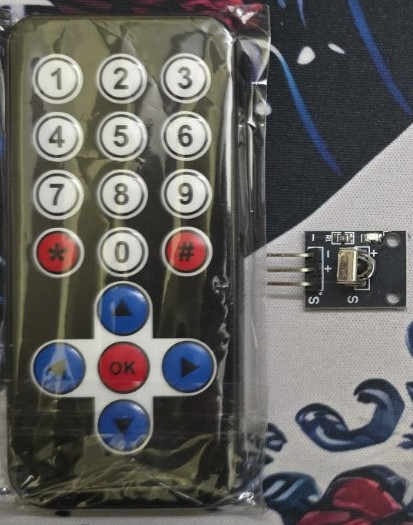

# IRRemoteMap Library

A lightweight, reusable Arduino/PlatformIO library that maps **IRremote decoded raw values** to friendly button identifiers.  
Built for small IR remotes commonly used with Arduino projects.  

This was developed as part of a hobby project and to ease my life.

This abstracts away raw HEX codes and gives you:

- `IRButton` enum for all buttons  
- `IRRemoteMap::getButton(rawValue)`  
- `IRRemoteMap::fromReceiver()`  
- `IRRemoteMap::toString(button)`  

Works with the **Arduino-IRremote** library.

## 🧭 Supported Buttons / Remote

These values were recorded on the following IR Remote: 



The library maps these raw HEX values:

| Button | Raw HEX    |
| ------ | ---------- |
| 1      | 0xBA45FF00 |
| 2      | 0xB946FF00 |
| 3      | 0xB847FF00 |
| 4      | 0xBB44FF00 |
| 5      | 0xBF40FF00 |
| 6      | 0xBC43FF00 |
| 7      | 0xF807FF00 |
| 8      | 0xEA15FF00 |
| 9      | 0xF609FF00 |
| *      | 0xE916FF00 |
| 0      | 0xE619FF00 |
| UP     | 0xE718FF00 |
| DOWN   | 0xAD52FF00 |
| LEFT   | 0xF708FE00 |
| RIGHT  | 0xA55AFF00 |
| OK     | 0xE31CFF00 |


---

## ✨ Features

- Clean, strongly-typed button enum  
- Simple `getButton()` function to map `decodedRawData`  
- Utility to read button directly from `IrReceiver`  
- Human-readable button names  
- Zero dependencies except `Arduino-IRremote`

---

## 📦 Installation

### **Option A — Local (recommended while developing)**

Place the library inside your PlatformIO project:
```
my_project/
├── lib/
│ └── IRRemoteMap/
│ ├── library.json
│ ├── src/
│ ├── examples/
│ └── ...
```

PlatformIO automatically discovers it.

---

### **Option B — Shared folder using `lib_extra_dirs`**

If you keep your reusable libraries outside projects:
```
C:/dev/IRRemoteMap
```


Add to your `platformio.ini`:

```ini
lib_extra_dirs = C:/dev
```


### **Option C — GitHub (recommended for reuse across machines)**

Add to platformio.ini:

lib_deps =
  https://github.com/pavitra14/IRRemoteMap.git


PlatformIO will fetch it automatically.

## 🔧 Usage Example
```cpp
#include <Arduino.h>
#include <IRremote.hpp>
#include "IRRemoteMap.h"

#define IR_PIN 3

void setup() {
  Serial.begin(115200);
  IrReceiver.begin(IR_PIN, ENABLE_LED_FEEDBACK);
}

void loop() {
  if (IrReceiver.decode()) {
    uint32_t raw = IrReceiver.decodedIRData.decodedRawData;

    IRButton btn = IRRemoteMap::getButton(raw);

    Serial.print("Button: ");
    Serial.println(IRRemoteMap::toString(btn));

    if (btn == IRButton::BTN_OK) {
      Serial.println("OK pressed");
    }

    IrReceiver.resume();
  }
}

```

